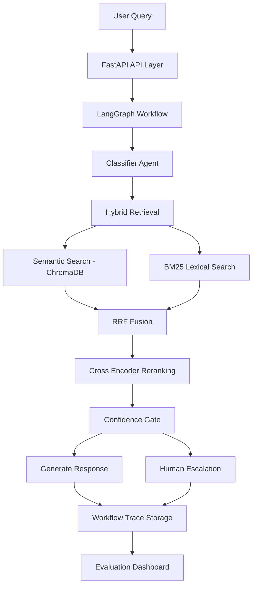
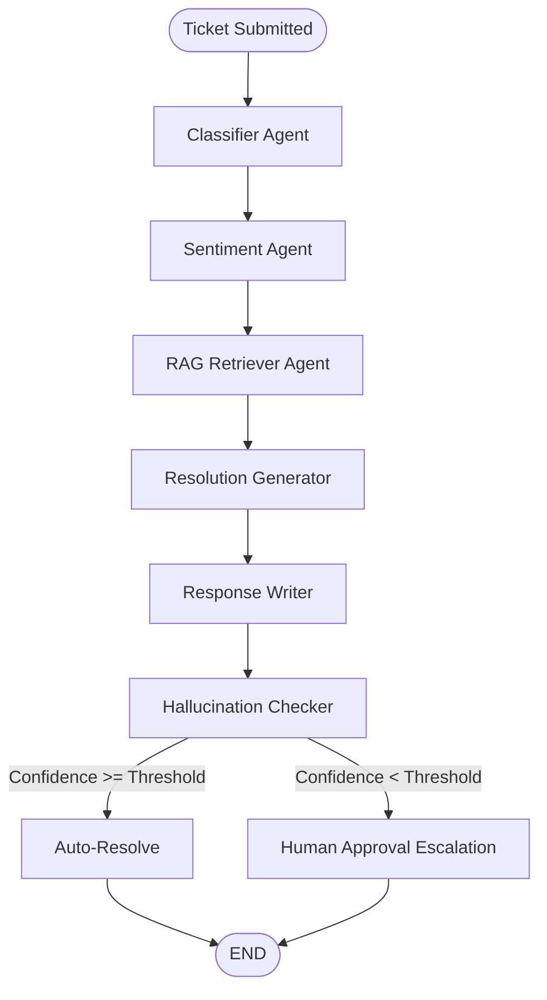

# AI SupportOps Platform

## 1. Project Overview
**AI SupportOps** is a production-grade, multi-tenant, agentic GenAI SaaS platform designed to automate customer support resolution. It moves beyond simple conversational chatbots by implementing an intelligent, stateful, workflow-driven orchestration platform. The system uses a LangGraph multi-agent architecture to autonomously classify tickets, retrieve tenant-specific knowledge, generate grounded resolutions, evaluate its own hallucination risk, and gracefully escalate to human agents via approval gates when confidence falls below required thresholds.

## 2. Problem Statement
Modern customer support teams struggle with high volumes of repetitive inquiries. Traditional automation relies on rigid decision trees that fail at nuance, while naive LLM chatbots often hallucinate, leak cross-tenant data, or lack the ability to take decisive resolution actions. Teams need a system that can understand complex intent, rely strictly on verified internal policies, and know exactly when a human needs to intervene.

## 3. Business Use Case
AI SupportOps serves B2B SaaS companies or e-commerce platforms handling thousands of support tickets daily. It acts as an autonomous Tier-1 support agent that can instantly resolve billing, shipping, and technical queries based solely on a company's internal knowledge base, dramatically reducing Time to Resolution (TTR) while maintaining strict enterprise security and data isolation per tenant.

## 4. Key Features
- **Multi-Agent Orchestration**: 7-node LangGraph state machine.
- **Strict Data Isolation**: Row-level Postgres security and tenant-filtered vector searches.
- **Self-Evaluating Quality Gates**: Real-time hallucination checking and confidence scoring.
- **Human-in-the-Loop Escalation**: Automated creation of approval requests for low-confidence outputs.
- **Provider-Agnostic LLM Layer**: Designed for Groq, extensible to OpenAI/Anthropic.
- **Full Traceability**: Granular execution tracking across all agent nodes for continuous evaluation.

## 4.5 Major Achievements
- **Hybrid RAG**: Semantic Search + BM25 Lexical Search combined via RRF.
- **Cross Encoder Reranking**: Reordering retrieved chunks with `ms-marco-MiniLM-L-6-v2` for maximum precision.
- **Confidence Gating**: Out-of-domain query protection using -6.0 threshold.
- **Workflow Traceability**: LangGraph execution nodes and state fully observable.
- **Source Attribution**: Transparent tracking of every document chunk used in generation.
- **Evaluation Dashboard**: Visual KPI metrics for retrieval health, hallucination rates, and latency.
- **Human-in-the-Loop Review**: Automated escalation queue for ambiguous queries.
- **Multi-Tenant Isolation**: Strict row-level database and vector-store filtering.

## 4.6 System Architecture

```text
User Query
    ↓
FastAPI API Layer
    ↓
LangGraph Workflow
    ↓
Classifier Agent
    ↓
Hybrid Retrieval
   ├── ChromaDB Semantic Search
   └── BM25 Lexical Search
    ↓
Reciprocal Rank Fusion (RRF)
    ↓
Cross Encoder Reranking
    ↓
Confidence Gate (-6.0)
   ├── Generate Response
   └── Human Escalation
    ↓
Workflow Trace Storage
    ↓
Evaluation Dashboard
```



## 5. Multi-Tenant Architecture
The platform enforces strict row-level isolation using a `TenantMixin` across all PostgreSQL tables. Every core entity (Tickets, Conversations, Vector Documents) is strictly bound to a `tenant_id`. In the vector database (ChromaDB), all searches explicitly map a `tenant_id` metadata filter directly into the `where` clause, guaranteeing that one company's AI agent can never hallucinate policies from another company's knowledge base.

## 6. Retrieval Architecture

### Dual-Storage Synchronization
1. **Source of Truth**: Raw text and structured metadata are stored securely in PostgreSQL (`KnowledgeArticle` table).
2. **Vector Index**: Document chunks are embedded via HuggingFace `all-MiniLM-L6-v2` and indexed in ChromaDB for high-speed semantic search.
3. **Asynchrony**: Computationally heavy IO calls are pushed to FastAPI's background threadpool to prevent blocking the async event loop.

### Hybrid Retrieval (Phase 15)
- **Semantic Retrieval**: Captures intent and meaning via Dense Vectors.
- **BM25 Lexical Retrieval**: Ensures exact keyword and acronym matching via Sparse Indexing.
- **Reciprocal Rank Fusion (RRF)**: Normalizes and merges dense and sparse results transparently.

### Cross-Encoder Reranking (Phase 16)
- **Reranker Model**: `cross-encoder/ms-marco-MiniLM-L-6-v2`
- **fetch_k**: 20 candidates retrieved before reranking to balance latency and recall.
- **Result**: Boosts Top-1 accuracy from 62.5% to 77.5%, and Top-3 accuracy to 87.5%.

### Confidence Gating (Phase 17)
- **Architecture**: `Retriever` → `Confidence Check` → `Generate` OR `Human Escalation`.
- **Threshold**: -6.0. Queries falling below this score trigger automatic Human Approval Escalation.
- **Benefits**: Eradicates hallucinations on out-of-domain queries and guarantees human safety.

### Source Attribution (Phase 11)
- The system embeds a `sources_used` and `retrieval_debug` payload inside every ticket, capturing exact provenance (`filename`, `chunk_index`, `similarity_score`, `retrieval_rank`) for transparent auditing.

## 7. LangGraph Architecture
A **LangGraph `StateGraph`** orchestrates 7 sequential agent nodes through a typed `SupportState` dictionary. Each node reads the shared state, calls the LLM, and returns partial state updates that LangGraph merges automatically. A conditional edge routes the flow based on a configurable confidence threshold.

## 7.5 Workflow Traceability (Phase 10)
- Deep transparency bridging backend workflows to the frontend UI.
- Records all `workflow_runs` and `workflow_node_executions` to track visited nodes, retrieval diagnostics, latency, and final ticket disposition.

## 8. Evaluation & Observability Architecture

The platform includes a dedicated evaluation and observability layer that continuously measures AI quality, workflow performance, and operational reliability.

### LangSmith Observability

The system supports optional LangSmith integration for:

- End-to-end workflow tracing
- Node-level execution visibility
- Token usage monitoring
- Latency tracking
- Workflow auditing and debugging

LangSmith integration is fully configurable through environment variables and gracefully degrades when disabled.

### RAGAS Evaluation Framework

The platform evaluates generated responses using RAGAS metrics:

- Faithfulness
- Answer Relevancy
- Context Precision
- Context Recall

RAGAS evaluations run using the configured Groq Fast Model (`llama-3.1-8b-instant`) and do not require OpenAI.

### Confidence Scoring System

The workflow persists:

- Retrieval confidence
- Generation confidence
- Overall confidence
- Threshold comparison results

These scores are used to determine escalation and approval routing decisions.

### Hallucination Detection

The platform records:

- Grounding issues
- Hallucination severity
- Evidence citations
- Faithfulness measurements

These signals are stored for analytics, monitoring, and future quality improvements.

### Sampling-Based Evaluation

To control API usage and evaluation costs:

- Evaluations are optional
- Sampling percentage is configurable
- Evaluation execution can be disabled entirely

Configuration:

```env
ENABLE_RAGAS=true
EVALUATION_SAMPLE_PERCENTAGE=10
```

This allows production deployments to balance quality monitoring with operational cost.

### Evaluation Dashboard (Phase 13)
- **Central KPI Tracking**: Retrieval Health Score, Avg Similarity, Avg Latency, Auto Resolution Rate, Escalation Rate, and Hallucination Rate.
- **Analytics View**: Tracks Failure Analysis, Document Leaderboards, and unretrieved assets.
- **Snapshots**: Generates daily `RetrievalEvaluationSnapshot` time-series data for trend visualization.

### Benchmark Results (Phase 14 & 16)
Tested via a 50-query baseline suite across Exact Match, Paraphrase, Ambiguous, Multi-Step, and Edge Cases.

## 8.5 Final Benchmark Results

| Metric                   | Baseline Semantic | Hybrid + Rerank          |
| ------------------------ | ----------------- | ------------------------ |
| Top-1 Accuracy           | 62.5%             | 77.5%                    |
| Top-3 Accuracy           | 82.5%             | 87.5%                    |
| Retrieval Type           | Semantic Only     | Semantic + BM25 + Rerank |
| Confidence Gating        | No                | Yes                      |
| Source Attribution       | No                | Yes                      |
| Workflow Traceability    | Limited           | Full                     |
| Hallucination Prevention | No                | Yes                      |

### Key Improvements

* Hybrid Retrieval solved exact keyword matching failures.
* BM25 improved sparse lexical matching.
* Cross-Encoder Reranking improved Top-1 precision.
* Confidence Gating prevented out-of-domain hallucinations.
* Workflow Traceability enabled complete retrieval diagnostics.
* Source Attribution provided explainable AI outputs.

## 9. Workflow Diagram


## 10. Tech Stack
- **Backend Framework**: FastAPI (Python 3.10+)
- **Database**: PostgreSQL (asyncpg), SQLAlchemy 2.0, Alembic
- **Agent Orchestration**: LangGraph, LangChain
- **LLM Provider**: Groq (`llama-3.3-70b-versatile`)
- **Vector Database**: ChromaDB
- **Embeddings**: `sentence-transformers` (`all-MiniLM-L6-v2`) via HuggingFace
- **Caching & Queues**: Redis
- **Containerization**: Docker, Docker Compose

## 11. Project Structure
```text
ai-supportops-platform/
├── backend/
│   ├── app/
│   │   ├── agents/         # LangGraph nodes, state, prompts, LLM factory
│   │   ├── api/v1/         # Modular versioned REST routes
│   │   ├── core/           # Config, logging, middleware, exceptions
│   │   ├── db/             # Session management, Repositories
│   │   ├── models/         # SQLAlchemy declarative models
│   │   ├── rag/            # Embeddings, Vectorstore, Chunkers, Retriever
│   │   ├── schemas/        # Pydantic validation schemas
│   │   ├── services/       # Business logic (WorkflowService)
│   │   └── main.py         # FastAPI application entrypoint
│   ├── alembic/            # Database migration scripts
│   ├── scripts/            # CLI utilities (seed, test scripts)
│   ├── Dockerfile          # Multi-stage container build
│   └── requirements.txt    # Python dependencies
├── PROJECT_PROGRESS.md     # Official Handover and Task Tracker
└── docker-compose.yml      # Infrastructure services
```

## 12. Database Architecture
A highly normalized, 15-table schema designed for AI workflow traceability:
- **Core Domain**: `Tenant`, `User`, `Ticket`, `Conversation`, `Message`
- **Workflow State**: `WorkflowRun`, `WorkflowNodeExecution`
- **Governance**: `ApprovalRequest`, `HallucinationFlag`, `ConfidenceScore`
- **Knowledge**: `KnowledgeArticle`, `AgentConfig`

## 13. ChromaDB Integration
ChromaDB runs as a standalone Docker service. The `TenantRetriever` seamlessly interfaces with it via an HTTP client, ensuring that `similarity_search_with_relevance_scores` returns highly contextualized document chunks filtered by `tenant_id`.

## 14. Groq Integration
The LLM layer is built around a provider-agnostic factory (`app/agents/llm.py`) currently defaulting to Groq via `langchain-groq`. It utilizes `llama-3.3-70b-versatile` for high-quality reasoning tasks and `llama-3.1-8b-instant` for faster, lightweight operations. JSON outputs are safely parsed to handle markdown block wrapping inherently generated by Llama models.

## 15. Docker Setup
The project utilizes a `docker-compose.yml` to spin up the required infrastructure layer locally:
- `postgres` (Port 5432)
- `redis` (Port 6379)
- `chromadb` (Port 8001)

## 16. Installation Instructions
1. Clone the repository.
2. Ensure Docker and Docker Compose are installed.
3. Start infrastructure: `docker compose up -d`
4. Set up the Python environment:
   ```bash
   cd backend
   python -m venv .venv
   source .venv/bin/activate
   pip install -r requirements.txt
   ```

## 17. Environment Variables
Create a `.env` file in the `backend/` directory:
```env
ENVIRONMENT="development"
SECRET_KEY="your_super_secret_key"
POSTGRES_USER="supportops"
POSTGRES_PASSWORD="supportops_dev_password"
POSTGRES_DB="supportops_db"
POSTGRES_HOST="localhost"
CHROMA_HOST="localhost"
CHROMA_PORT=8001
GROQ_API_KEY="gsk_your_groq_api_key"
AGENT_CONFIDENCE_THRESHOLD=0.7

# Observability & Evaluation
LANGCHAIN_TRACING_V2=false
LANGCHAIN_API_KEY="ls__..."
ENABLE_RAGAS=true
EVALUATION_SAMPLE_PERCENTAGE=10
```

## 18. Running Migrations
Run Alembic to initialize the PostgreSQL schema:
```bash
cd backend
source .venv/bin/activate
alembic upgrade head
```

## 19. Seeding Knowledge Base
Populate PostgreSQL and ChromaDB with demo corporate policies:
```bash
python scripts/seed_kb.py
```
*(This generates a `demo_tenant_id.txt` file used by the testing scripts.)*

## 20. Running RAG Tests
Validate tenant-scoped semantic retrieval:
```bash
python scripts/test_retrieval.py
```

## 21. Running Workflow Tests
Execute the end-to-end LangGraph multi-agent pipeline:
```bash
python scripts/test_workflow.py
```

## 22. Current Project Status
The platform has evolved from a foundational API into a complete, enterprise-grade AI SupportOps platform encompassing Hybrid Retrieval, Cross-Encoder Reranking, Strict Confidence Gating, Workflow Traceability, and an Enterprise UI Dashboard.

### Current Production Capabilities
- Fully integrated RRF Hybrid Retrieval + Reranking.
- Autonomous out-of-domain rejection and human-in-the-loop escalation routing.
- Real-time observability dashboard for evaluations, traces, and metrics.
- Intelligent Knowledge Base with auto-reindexing and duplication prevention.
- Seamless multi-tenant data isolation.

## 23. Completed Phases
- ✅ **Phase 1-3**: Backend Foundation, Infrastructure, DB Layer
- ✅ **Phase 4-5**: RAG Pipeline, LangGraph Multi-Agent Workflow
- ✅ **Phase 6-7**: Evaluation, Observability, FastAPI
- ✅ **Phase 8**: Frontend UI Dashboard
- ✅ **Phase 9**: Knowledge Base Reliability & Reindexing
- ✅ **Phase 10**: Workflow Observability & Traceability
- ✅ **Phase 11**: Retrieval Diagnostics & Source Attribution
- ✅ **Phase 12**: Knowledge Base Integrity & Duplicate Cleanup
- ✅ **Phase 13**: Retrieval Evaluation Dashboard
- ✅ **Phase 14**: Retrieval Benchmarking
- ✅ **Phase 15**: Hybrid Retrieval
- ✅ **Phase 16**: Cross-Encoder Reranking
- ✅ **Phase 17**: Confidence Gating
- ✅ **Phase 18**: Evaluation Service Stabilization

## 23.5 Business Impact

AI SupportOps is designed to reduce the operational burden on customer support teams while increasing response quality and transparency.

### Operational Benefits

* Reduces repetitive support workload.
* Accelerates customer response times.
* Improves first-response resolution rates.
* Minimizes manual triage effort.
* Prevents unsafe AI-generated responses.

### Enterprise Benefits

* Strict tenant-level data isolation.
* Fully auditable AI decisions.
* Transparent source attribution.
* Human-in-the-loop safety controls.
* Retrieval quality monitoring and benchmarking.

### Expected Outcomes

* Lower support costs.
* Higher support team productivity.
* Improved customer satisfaction.
* Faster ticket resolution.
* Safer enterprise AI adoption.

## 24. Future Roadmap (Pending Phases)
- **Deployment**: Production-grade WSGI/ASGI configurations.
- **CI/CD**: Automated GitHub Action pipelines for testing and builds.
- **Cloud Hosting**: Migration to AWS/Vercel/Railway architecture.
- **Production Monitoring**: Integrating Sentry and Datadog.

### Retrieval & AI Enhancements
* Multi-LLM Routing
* Provider Failover (Groq/OpenAI/Anthropic)
* Agent Parallel Execution
* Adaptive Confidence Thresholds
* Automated Prompt Evaluation

### Infrastructure Enhancements
* Kubernetes Deployment
* Horizontal Scaling
* WebSocket Real-Time Updates
* Distributed Worker Architecture

### Observability Enhancements
* Cost Monitoring Dashboard
* Token Usage Analytics
* Advanced Latency Monitoring
* Production Alerting

### Knowledge Base Enhancements
* Pinecone Integration
* Weaviate Integration
* Automated Document Sync
* Knowledge Drift Detection

## 25. Known Limitations
1. **CPU Bound Embeddings**: `all-MiniLM-L6-v2` runs on the CPU. Large document ingestions will spike CPU usage without GPU acceleration.
2. **Synchronous Execution**: The LangGraph pipeline currently runs sequentially. Total latency per ticket can be 3-5 seconds.
3. **Ghost Vectors**: Deleting an article in Postgres directly (bypassing the application layer) does not automatically delete corresponding ChromaDB vectors.

## 26. Future Enhancements
- **Parallel Agent Execution**: Run the Classifier and Sentiment nodes concurrently.
- **Automated Re-indexing**: Add database triggers/webhooks to auto-sync Postgres updates to ChromaDB.
- **Provider Fallbacks**: Implement automatic failover from Groq to Anthropic/OpenAI during API outages.
